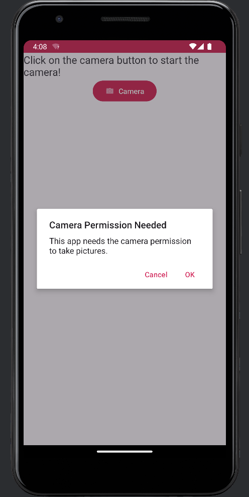
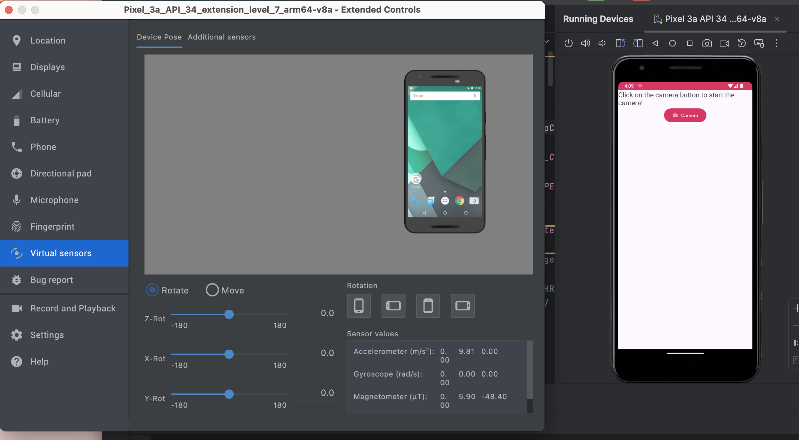
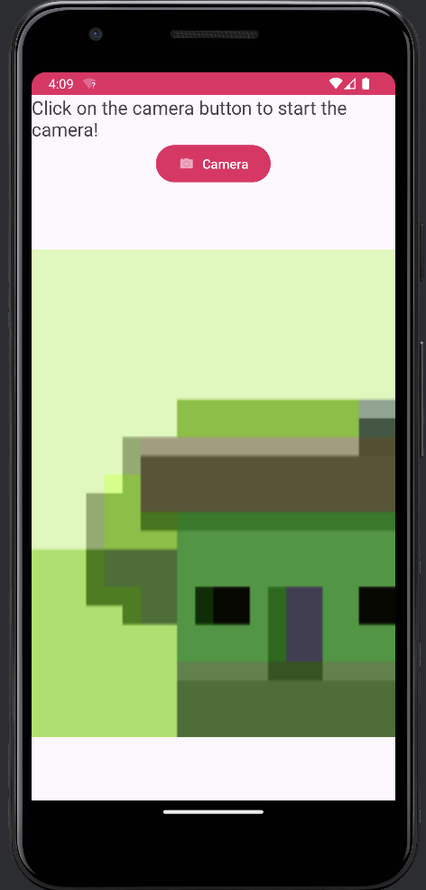

# CameraAPP
An android app that opens the camera by moving the device.

## DESCRIPTION
This is a app that uses the **accelerometer** of your mobile device in order to open the camera app 

## WHAT IS AN ACCELEROMETER USED FOR?
Accelerometers measure acceleration, which in practical terms means changes in speed or direction.

## FILES
Begin by **downloading the .zip file and extracting all the contents**. After the downloading open the file contents on
_AndroidStudio _ IDE.
There is two main files in the zip . The first one is the main activity which contains the code for the camera permission and the listeners. The second one contains the code for the accelerometer 

In order to see the source code open the folder ***app*** then ***src*** and ***main,java,com,example,mycamera***

## CODE
For this project, 
XML, was used to make the UI 
Java,was used for the source code

## PAGES 
This is the _main_ page of the app

This is the _consent_ page 

This is the _accelerometer_ page 

**if you don't own an android device** you can use the **extended controls** of the IDE by **clicking** thw 3 dots above the emulator and then by **clicking virtual sensors** you can move and rotate the device 

This is the _final_ page 

