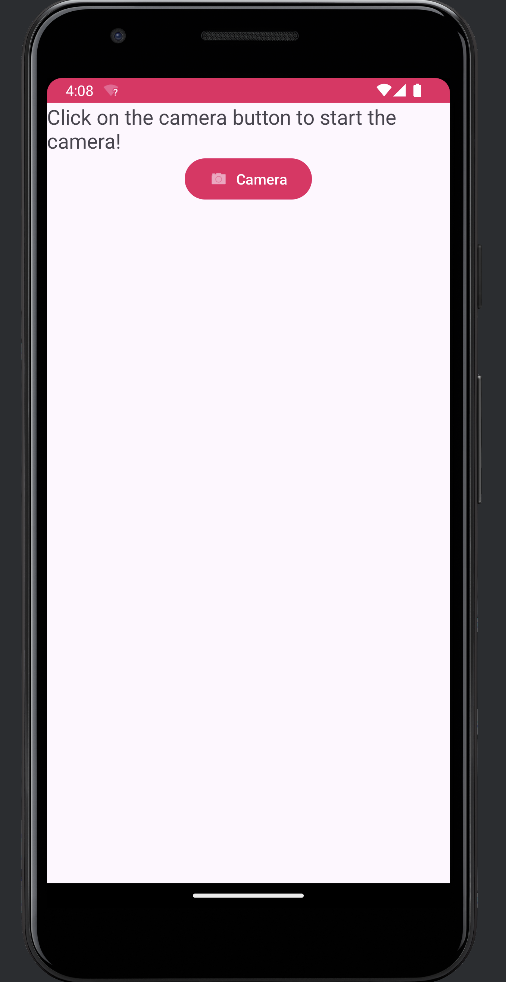

# CameraAPP
An android app that opens the camera by moving the device.

## DESCRIPTION
This is a app that uses the **accelerator** of your mobile device in order to open the camera app 
## FILIES
Begin by **downloading the .zip file and extracting all the contents**. After the downloading open the file contents on _AndroidStudio _ IDE.
In order to see the code open the folder ***app*** then ***src*** and ***main,java,com,example,mycamera***

## CODE
For this project, 
XML, was used to make the UI 
Java,was used for the source code

## PAGES 
This is the _main_ page of the app

